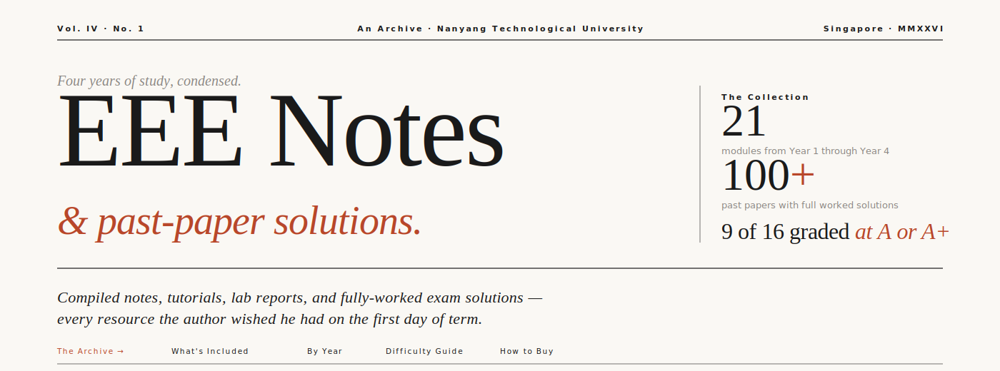
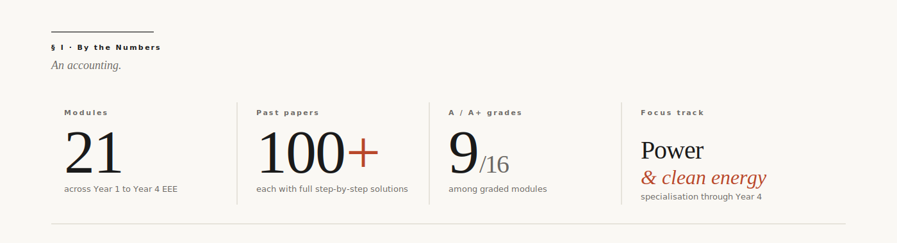
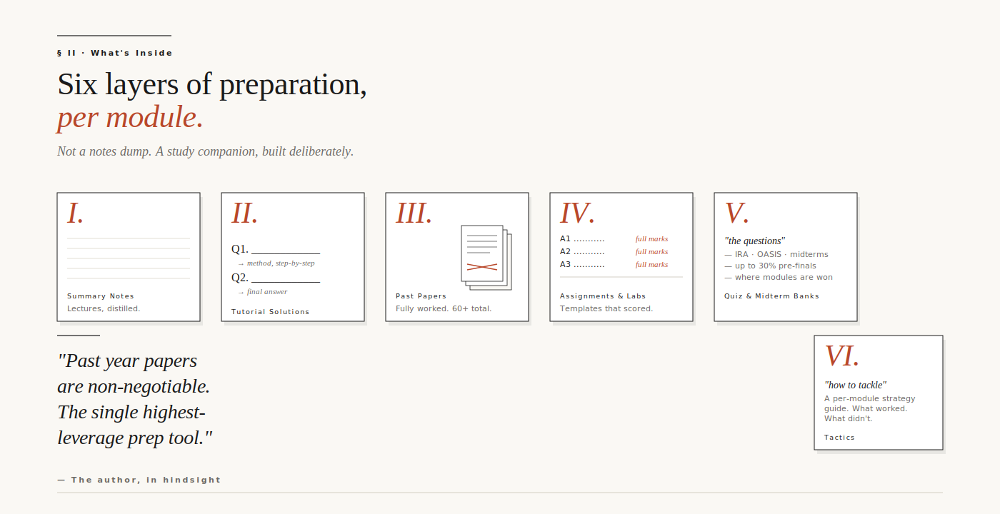
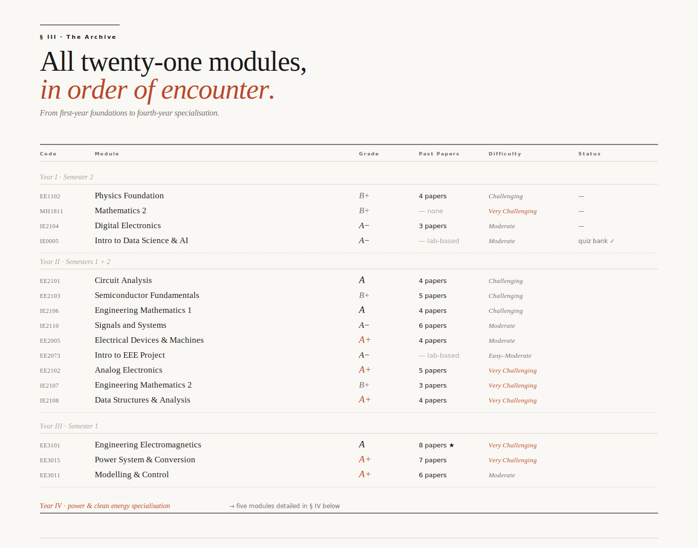
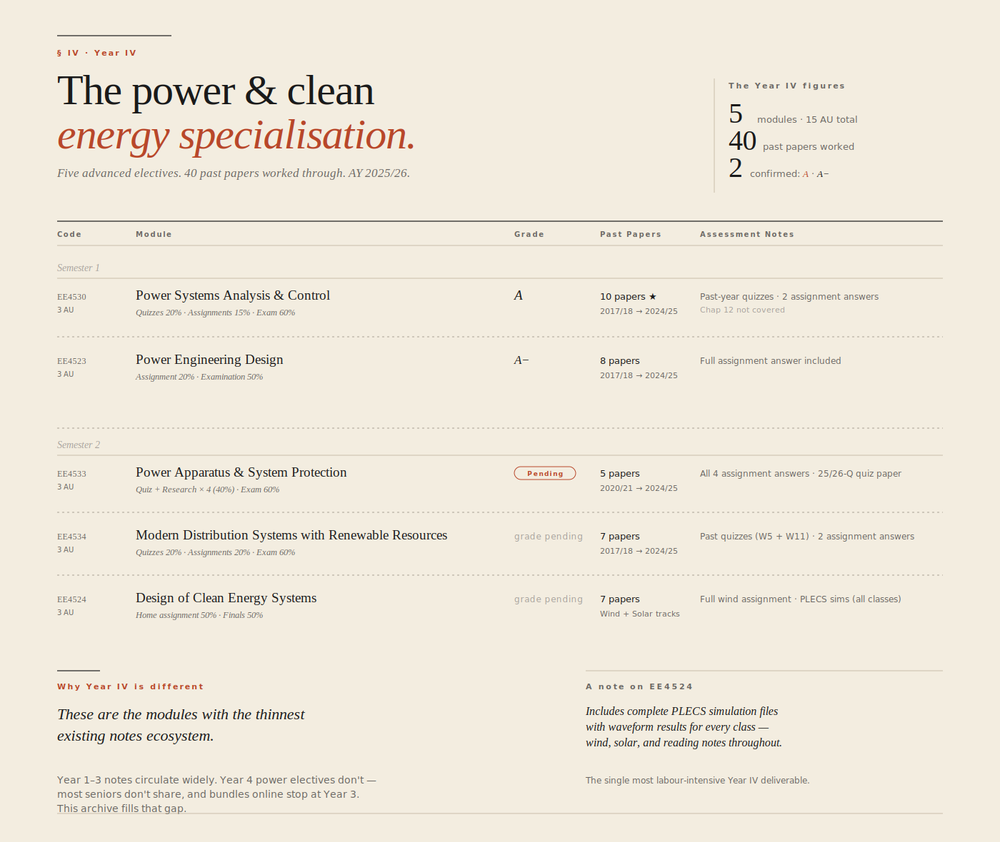
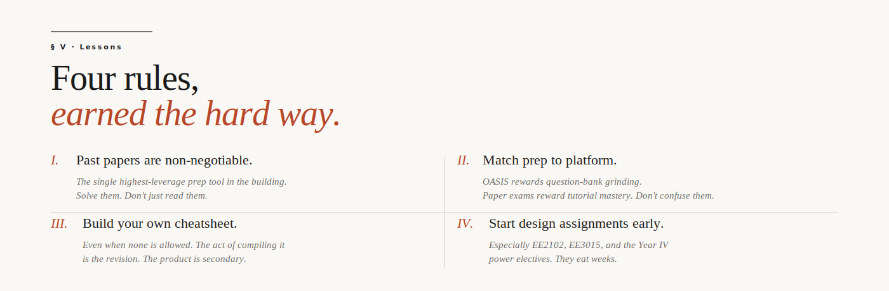

  

&nbsp;

  <a href="#-the-archive"><b>The Archive</b></a>
  &nbsp;·&nbsp;
  <a href="#-whats-inside-each-module"><b>What's Inside</b></a>
  &nbsp;·&nbsp;
  <a href="#-year-iv--power--clean-energy-specialisation"><b>Year IV</b></a>
  &nbsp;·&nbsp;
  <a href="#-four-rules"><b>Lessons</b></a>
  &nbsp;·&nbsp;
  <a href="#-how-to-buy"><b>Buy</b></a>

&nbsp;

---

  

---

## § What's Inside Each Module

  

> Each module package is built as a complete study companion — not a notes dump. Exact contents vary by module; the full breakdown is in **The Archive** below.

---

## § The Archive

  

&nbsp;

### Detailed Module Breakdowns

Click any module to expand its full contents.

<b>Year 1 · Semester 2</b> — four modules

 

**EE1102 · Physics Foundation** — *B+ · Challenging*
> Optics, electromagnetism, and quantum physics. Foundation for EE3101 in Year 3.

- Final summary notes (13 chapters, 13 pages)
- Midterm summary notes (10 pages)
- Tutorial answers (Week 3–13)
- Take-home assignment (10%) & labsheet answers (10%)
- **4 past year papers** with full solutions: 2021 S2, 2021 S1, 19/20 S1, 18/19 S2

**MH1811 · Mathematics 2** — *B+ · Very Challenging*
> Sequences, series, multivariable calculus, differential equations. Proof-heavy.

- Final summary notes (Chapters 1–13, 33 pages)
- Midterm summary notes (10 pages)
- Tutorial answers (Week 3–12)
- Midterm & finals cheatsheets
- Worked examples for every lecture concept
- *No past year papers available*

**IE2104 · Digital Electronics** — *A− · Moderate*
> Number systems, logic gates, combinatorial circuits.

- Final summary notes (Chapters 3–13, 24 pages)
- Tutorial answers (Week 3–12)
- OASIS assignment answers
- **3 past year papers** with full solutions: 2021 S2, 2021 S1, 19/20 S1

**IE0005 · Introduction to Data Science & AI** — *A− · Moderate*
> Data analytics, ML, computer vision, NLP — application-led.

- Lab test questions & answers (25% component, full marks)
- Final quiz sample questions (covers ~50% of actual quiz)
- *Lab-based module — no past year papers*

<b>Year 2 · Semester 1</b> — four modules

 

**EE2101 · Circuit Analysis** — *A · Challenging*
> Nodal/mesh, Thevenin/Norton, AC analysis, transients. Difficulty ramps after mid-semester.

- Tutorial answers (Week 1–12)
- Midterm OASIS workings
- Step-by-step full-mark solutions for Assignments 1 & 2
- Compiled finals summary notes
- **4 past year papers** with full solutions

**EE2103 · Semiconductor Fundamentals** — *B+ · Challenging*
> Quantum physics applied to semiconductor devices. Tutorials harder than the exam.

- Tutorial answers (Week 1–12)
- IRA questions & answers (4 of 6 sets)
- Past midterm OASIS questions & answers
- Take-home assignment answers
- **5 past year papers** with full solutions

**IE2106 · Engineering Mathematics 1** — *A · Challenging*
> Probability, numerical methods, Laplace, PDEs. Midterms demand precision (8 d.p.).

- Tutorial answers (Week 1–12)
- OASIS practice workings
- Step-by-step full-mark solutions for Assignments 1 & 2
- **4 past year papers** with full solutions

**IE2110 · Signals and Systems** — *A− · Moderate*
> Fourier-heavy. Weekly IRAs (20%) carry serious weight.

- Tutorial answers (Week 1–12)
- Past IRA & midterm questions with answers (30% weightage)
- Compiled finals summary notes
- **6 past year papers** with full solutions

<b>Year 2 · Semester 2</b> — five modules

 

**EE2005 · Electrical Devices & Machines** — *A+ · Moderate*
> Transformers, DC machines, induction & synchronous motors. Formula-heavy.

- Tutorial answers (Week 1–12)
- Step-by-step full-mark assignment solutions
- EDM labsheets & answers
- **4 past year papers** with full solutions

**EE2073 · Introduction to EEE Project** — *A− · Easy–Moderate*
> Lab-based project work. Everything done in session.

- Weekly reflections & code for all 9 labs
- Final report (template-quality)
- Quiz question bank (24 questions)
- *Lab-based module — no past year papers*

**EE2102 · Analog Electronics** — *A+ · Very Challenging*
> Op-amps, filters, amplifier topologies. Three design assignments eat weeks each.

- Tutorial answers (Week 1–13)
- Step-by-step full-mark solutions for all 3 design assignments
- Design labsheet workings & answers
- Past midterm questions
- **5 past year papers** with full solutions

**IE2107 · Engineering Mathematics 2** — *B+ · Very Challenging*
> Linear algebra & vectors. Abstract and theoretical.

- Tutorial answers (Week 1–12)
- CA1 questions & answers
- CA3 questions & answers (AY22/23 + AY23/24)
- **3 past year papers** with full solutions

**IE2108 · Data Structures & Analysis** — *A+ · Very Challenging*
> Python, data structures, algorithmic analysis. Brutal without Python background.

- Tutorial answers (Week 1–13)
- IRA & midterm questions with answers (30% weightage)
- **4 past year papers** with full solutions

<b>Year 3 · Semester 1</b> — three modules

 

**EE3101 · Engineering Electromagnetics** — *A · Very Challenging*
> Maxwell's equations, EM waves, reflection/transmission. First half theory-heavy, second half mechanical.

- Tutorial answers (Week 1–13)
- OASIS weekly assessment Q&A
- Class participation questions & answers
- Lab answers
- **8 past year papers** with full solutions — *largest collection in this archive*

**EE3015 · Power System & Conversion** — *A+ · Very Challenging*
> Power generation, transmission, fault analysis, conversion. ~60 formulas. No formula sheet.

- Tutorial answers (Week 1–13)
- Midterm questions & answers (full marks, 20% weightage)
- OASIS questions & answers (full marks, 10% weightage)
- Labsheets & answers
- **7 past year papers** with full solutions

**EE3011 · Modelling & Control** — *A+ · Moderate*
> PID, root-locus, Bode, Nyquist, compensation. Looks intimidating, isn't.

- Tutorial answers (Week 1–13)
- Midterm questions & answers (full marks, 30% weightage)
- Labsheets & answers
- **6 past year papers** with full solutions

---

## § Year IV · Power & Clean Energy Specialisation

  

&nbsp;

### Detailed Year IV Breakdowns

<b>Semester 1</b> — two modules

 

**EE4530 · Power Systems Analysis & Control** — *A · 3 AU*
> Quizzes 20% · Homework Assignments 15% · Examination 60%

- **10 past year papers** with full solutions — 2017/18 through 2024/25 *(largest single-module collection in the entire archive)*
- Past-year quiz papers for Quiz 1 (Week 5) and Quiz 2 (Week 12)
- Complete answers for Homework Assignments 1 & 2
- *Note: Chapter 12 not covered in past paper sweep*

**EE4523 · Power Engineering Design** — *A− · 3 AU*
> Assignment 20% · Examination 50%

- **8 past year papers** with full solutions — 2017/18 through 2024/25
- Complete assignment answer included
- Every past paper from the last 8 years worked through

<b>Semester 2</b> — three modules

 

**EE4533 · Power Apparatus & System Protection** — *Grade pending · 3 AU*
> Assignment Quiz 1 (10%) · Research Assignment 1 (10%) · Quiz 2 (10%) · Research Assignment 2 (10%) · Examination 60%

- **5 past year papers** with full solutions — 2020/21 through 2024/25
- Complete answers for all four assessment components (40% of grade)
- Quiz 2 paper with 25/26-question coverage
- *Note: Theory questions excluded from earlier-year papers; topics not covered noted per paper*

**EE4534 · Modern Distribution Systems with Renewable Resources** — *Grade pending · 3 AU*
> Quiz 1 (10%, W5) · Quiz 2 (10%, W11) · Assignment 1 (10%, W7) · Assignment 2 (10%, W13) · Examination 60%

- **7 past year papers** with full solutions — 2017/18 through 2024/25
- Past-year quiz papers for both Quiz 1 and Quiz 2
- Complete answers for Assignments 1 & 2

**EE4524 · Design of Clean Energy Systems** — *Grade pending · 3 AU*
> Home Assignment 50% · Finals 50%

- **7 past year papers** with full solutions — every Wind/Solar variation 2017/18 through 2024/25
- Complete home assignment answer (Wind track, 50% of grade)
- **Full PLECS simulation files** with waveform results for every class — Wind and Solar
- Reading notes throughout the semester

> **Why Year IV matters most.** Year 1–3 EEE notes circulate widely on Carousell, Telegram, and student forums. Year 4 power electives don't — most seniors specialising in power keep their materials, and online bundles almost universally stop at Year 3. If you're on the power & clean energy track, this is the part of the archive you can't find elsewhere.

---

## § Four Rules

  

---

## § How to Buy

<!-- Edit this section with your actual purchase details -->

Reach out via the channels below to enquire about pricing, individual module bundles, or full archive access. Bundles available by year, by semester, or à la carte.

- **GitHub:** open an issue or DM
- **Email:** _[your email]_
- **Carousell / Telegram:** _[your handle]_

---

**Disclaimer.** Content reflects the curriculum as taught during the author's semesters at NTU EEE. Course structures, weightages, and content may have shifted since. Accuracy is not guaranteed unless stated explicitly. These materials are study references — not a substitute for attending lectures and doing your own work. Use at your discretion.

  <i>All the best for your exams.</i>

